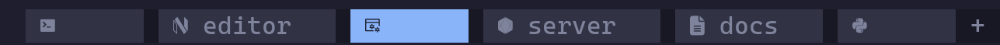
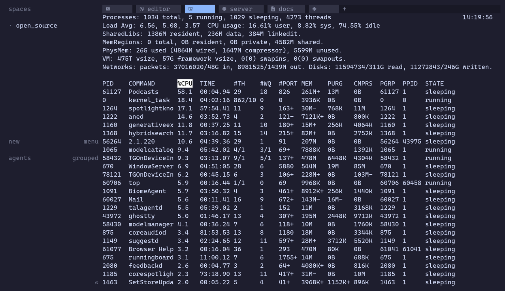

# herdr-nerd-font-tab-name-windows

Nerd Font icons for your [herdr](https://herdr.dev) tabs. Every tab shows an
icon for whatever is actually running in it — and a tab still carrying its
generated number gets the number replaced outright.



Six tabs above: an idle shell, `nvim` in a tab named *editor*, `top` (focused),
`node` in *server*, `man ls` in *docs*, and `python3`. Three of them were never
named, so their numbers are gone entirely.



## Credit where it's due

This project is a **Windows port** of **[herdr-nerd-font-tab-name](https://github.com/rohankewal/herdr-nerd-font-tab-name)** by **[Rohan Kewalramani](https://github.com/rohankewal)** — which itself was a port of **[tmux-nerd-font-window-name](https://github.com/joshmedeski/tmux-nerd-font-window-name)** by **[Josh Medeski](https://github.com/joshmedeski)**.

The original plugin's icon map and configuration format are lifted straight from the tmux plugin so the two stay interchangeable. If you use tmux, go use Josh's version; it is excellent, and he also wrote [a blog post and video](https://www.joshmedeski.com/posts/tmux-nerd-font-window-name-plugin/) about it. Josh also maintains [sesh](https://github.com/joshmedeski/sesh) and [tmux-fzf-url](https://github.com/joshmedeski/tmux-fzf-url), both worth your time.

This Windows fork adds:
- Cross-platform support (Windows, macOS, Linux)
- Event-driven one-shot mode for Windows (no persistent daemon needed)
- Folder-based icon resolution (e.g., `.pi` folder shows pi icon, `git-repos` shows git icon)
- Windows-compatible paths (`%APPDATA%`, `%LOCALAPPDATA%`)
- PowerShell startup hook and batch wrapper

## Requirements

- herdr 0.7.0 or newer
- A [Nerd Font](https://www.nerdfonts.com/) in your terminal
- Python 3.8+

## Install

```sh
herdr plugin install YOUR_GITHUB_USER/herdr-nerd-font-tab-name-windows
```

Or from a local checkout:

```sh
git clone https://github.com/YOUR_GITHUB_USER/herdr-nerd-font-tab-name-windows.git
herdr plugin link /path/to/herdr-nerd-font-tab-name-windows
```

Either way, restart herdr — or start the watcher without restarting:

```sh
herdr plugin action invoke herdr-nerd-font-tab-name.restart
```

To remove it:

```sh
herdr plugin action invoke herdr-nerd-font-tab-name.stop   # restores your labels
herdr plugin unlink herdr-nerd-font-tab-name
```

## What it does

| Tab label before | Running       | Tab label after |
| ---------------- | ------------- | --------------- |
| `3`              | an idle shell | `` (icon only) |
| `3`              | `nvim`        | ``             |
| `editor`         | `nvim`        | ` editor`      |
| `api`            | `claude`      | ` api`         |
| `.pi`            | idle shell    | ` .pi`         |
| `git-repos`      | idle shell    | ` git-repos`   |

By default (`show-name: auto`) a tab still carrying herdr's generated number is
replaced by the icon alone, and a tab you actually named keeps its name beside
the icon. Rename a tab whenever you like — the plugin adopts the new name and
keeps the icon in front of it. Nothing you typed is ever lost, and icons never
stack up.

Icons resolve in this order:

1. **herdr's agent detection.** A pane running Claude Code, Codex, Gemini and
   friends is labelled from the `agents:` map, no matter what the process tree
   underneath looks like.
2. **The foreground process**, via `pane.process_info` — so `man ls` shows the
   pager it is actually sitting in, not the shell that launched it.
3. **The working directory folder**, via `cwd`/`foreground_cwd` — so folders
   like `.pi` or `git-repos` show their own icons.
4. **The pane's terminal title**, when herdr can't see a foreground process.
5. **The fallback icon.**

## Configuration

Create the config file at:
- **Unix**: `~/.config/herdr/herdr-nerd-font-tab-name.yml`
- **Windows**: `%APPDATA%\herdr\herdr-nerd-font-tab-name.yml`

Only the keys you want to change; the rest fall back to [`config/defaults.yml`](config/defaults.yml).

```yml
config:
  show-name: "auto"        # auto | true | false
  icon-position: "left"    # left | right
  fallback-icon: "?"
  multi-pane-icon: ""     # blank disables
  poll-interval: 2

icons:
  zsh: ""                 # override anything from the defaults
  cmatrix: "🤯"            # or add your own — emoji work fine

agents:
  claude: ""
```

| Key                         | Default    | Meaning                                                            |
| --------------------------- | ---------- | ------------------------------------------------------------------ |
| `show-name`                 | `auto`     | `auto` drops herdr's generated tab number, keeps real names         |
| `icon-position`             | `left`     | Which side of the label the icon sits on                            |
| `fallback-icon`             | `?`        | Shown when nothing matches                                          |
| `always-show-fallback-name` | `false`    | Keep the name beside the fallback icon even when `show-name: false` |
| `multi-pane-icon`           | *(blank)*  | Prefixed when a tab holds more than one pane                        |
| `sem-version-icon`          | `null`     | Icon for labels that look like `1.2.3`                              |
| `prefer-agent-icons`        | `true`     | Let herdr's agent detection win over the process name               |
| `agent-fallback-icon`       | `󰚩`        | Icon for a detected agent with no `agents:` entry                   |
| `use-argv0`                 | `true`     | `npm run dev` shows npm rather than node                            |
| `title-fallback`            | `true`     | Guess from the pane title when no foreground process is reported    |
| `poll-interval`             | `2`        | Seconds between safety-net passes; `0` means events only            |
| `rename-auto-tabs-only`     | `false`    | Only touch tabs still carrying their generated number               |

Config is read when the watcher starts, so apply changes with:

```sh
herdr plugin action invoke herdr-nerd-font-tab-name.restart
```

A custom config path works too:

```sh
export HERDR_NERD_FONT_TAB_NAME_CONFIG=~/dotfiles/herdr-icons.yml
```

## Commands

The plugin ships a small CLI, handy for testing config changes:

```sh
bin/herdr-nerd-font-tab-name once            # apply icons one time
bin/herdr-nerd-font-tab-name start           # start the watcher (Unix)
bin/herdr-nerd-font-tab-name stop --restore  # stop it and put your labels back
bin/herdr-nerd-font-tab-name restart
bin/herdr-nerd-font-tab-name status
bin/herdr-nerd-font-tab-name icon nvim       # what does this name resolve to?
bin/herdr-nerd-font-tab-name icon claude --agent
```

On Windows, use the `.cmd` wrapper:

```cmd
bin\herdr-nerd-font-tab-name.cmd once
bin\herdr-nerd-font-tab-name.cmd icon nvim
bin\herdr-nerd-font-tab-name.cmd refresh    # event-driven one-shot
```

All of them honour `HERDR_SESSION` / `HERDR_SOCKET_PATH`, so they act on the
same session the `herdr` CLI would.

## How it works

### Unix (Persistent Watcher)
tmux regenerates window names from `automatic-rename-format` on every redraw,
so upstream can be a one-shot script that prints an icon and exits. herdr tab
labels are persistent state written over a socket API, so the Unix port is a
watcher:

- The `[[startup]]` hook spawns a detached watcher. herdr startup hooks are
  explicitly one-shot and unsupervised, so the watcher supervises itself: it
  exits when the herdr server closes the event stream.
- It holds one `events.subscribe` connection and refreshes on tab, pane and
  layout events, debounced by 150 ms.
- A two-second poll catches foreground changes that emit no event.
- Each pass reads `session.snapshot`, asks `pane.process_info` about the pane
  that speaks for each tab, and calls `tab.rename` only when the label would
  actually change.
- It records each tab's base label under
  `~/.local/state/herdr-nerd-font-tab-name/`, which is what keeps icons from
  stacking and your own renames from being clobbered.
- A `tab.created` event hook re-runs `start`, a no-op while a watcher holds the
  session lock. That's the safety net if the watcher ever dies.

### Windows (Event-Driven One-Shot)
Windows doesn't support AF_UNIX sockets or long-lived background processes from
herdr event hooks. Instead, this port uses the `herdr` CLI for all API calls
and registers event hooks that run a single rename pass:

- No persistent daemon — each event hook runs `refresh` and exits.
- Uses `herdr` CLI subprocess for API calls (cross-platform, works over named pipes).
- Registers event hooks for: `tab.created`, `tab.renamed`, `tab.focused`,
  `pane.created`, `pane.focused`, `pane.agent_detected`, `pane.agent_status_changed`, `pane.exited`.
- State stored in `%LOCALAPPDATA%\herdr-nerd-font-tab-name\`.
- File locking via `portalocker`, PID checks via `psutil`/`tasklist`.

Two things about herdr's API that cost me an afternoon, recorded here in case
they save someone else one:

- **The socket answers one request per connection, then hangs up.** Event
  subscriptions are the exception. Reuse a connection for a second request and
  you get `BrokenPipeError`.
- **`foreground_processes` is ordered innermost first.** `man ls` reports
  `[less, sh, sh]`, so the first entry is the command in front of you.
- **Don't key plugin state off `HERDR_PLUGIN_STATE_DIR`.** herdr only sets it
  when it launches the command itself, so a watcher started by the startup hook
  and a `stop` you run from a shell land in different directories, never see
  each other's pid file, and you end up with two watchers fighting over every
  tab.

## How it differs from the tmux plugin

- **Icons attach to your tab name rather than replacing it.** A tmux window
  name *is* the running command; a herdr tab label is a name you chose. So the
  icon goes in front of the label — unless the label is still an auto-generated
  number, which `show-name: auto` drops.
- **Agent icons.** herdr detects which AI coding agent a pane is running, so
  agents get their own map keyed by herdr's canonical agent ids.
- **Folder icons.** Folder names from `cwd`/`foreground_cwd` are resolved
  against the `icons:` map (e.g., `.pi`, `git-repos`, `dotfiles`).
- **Five icons updated for Nerd Fonts v3.** Upstream still carries v2-era
  codepoints for `ansible`, `R`, `terraform`, `vue` and `zig` that v3 fonts
  dropped. Every glyph here is verified present in a v3 patched font.
- **Config lives at `~/.config/herdr/herdr-nerd-font-tab-name.yml`** (Unix) or
  `%APPDATA%\herdr\herdr-nerd-font-tab-name.yml` (Windows), in the same flat
  YAML dialect, so icon maps copy across between the two projects.

## Development

```sh
make test   # 52 tests, stdlib-only (plus portalocker, psutil for Windows)
make lint
```

The tests cover icon resolution, label composition, folder icons, and full
rename passes against a fake herdr connection. Windows-specific tests run 5x
for flakiness detection. Adding an icon is a one-line change to
`config/defaults.yml` — please check the glyph exists in a current Nerd Font
before sending it.

## Licence

[MIT](LICENSE) for the code here. The icon map and configuration format come
from [tmux-nerd-font-window-name](https://github.com/joshmedeski/tmux-nerd-font-window-name)
by Josh Medeski, which publishes no licence file. No licence claim is made over
that material here; it remains Josh's, and it is included with attribution and
gratitude. If you intend to reuse the icon map itself, take it up with upstream.

---

**Original author**: Rohan Kewalramani (rohankewal/herdr-nerd-font-tab-name)  
**Windows port**: mohit (this fork)  
**Upstream icon map**: Josh Medeski (joshmedeski/tmux-nerd-font-window-name)